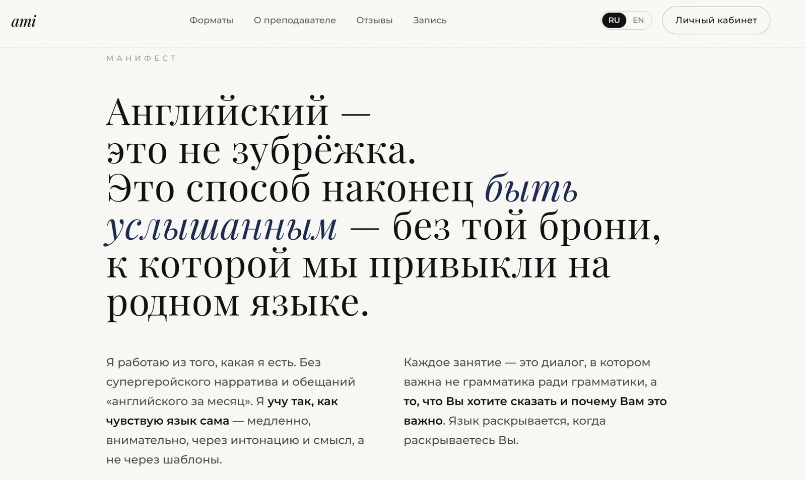
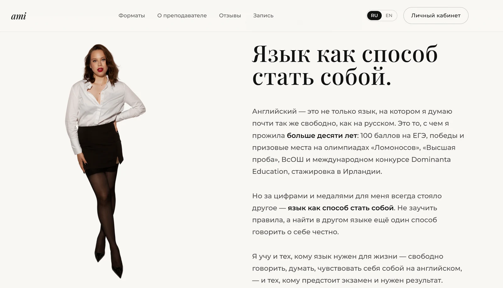
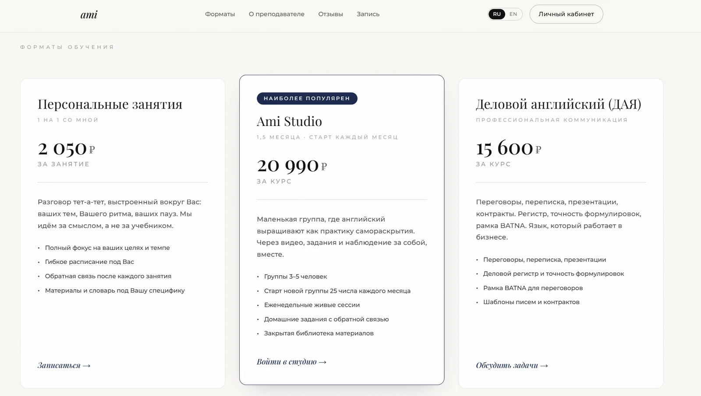
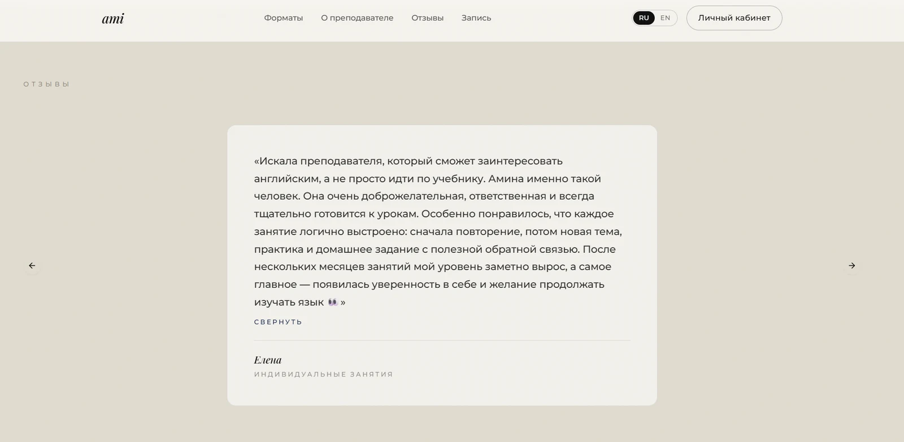
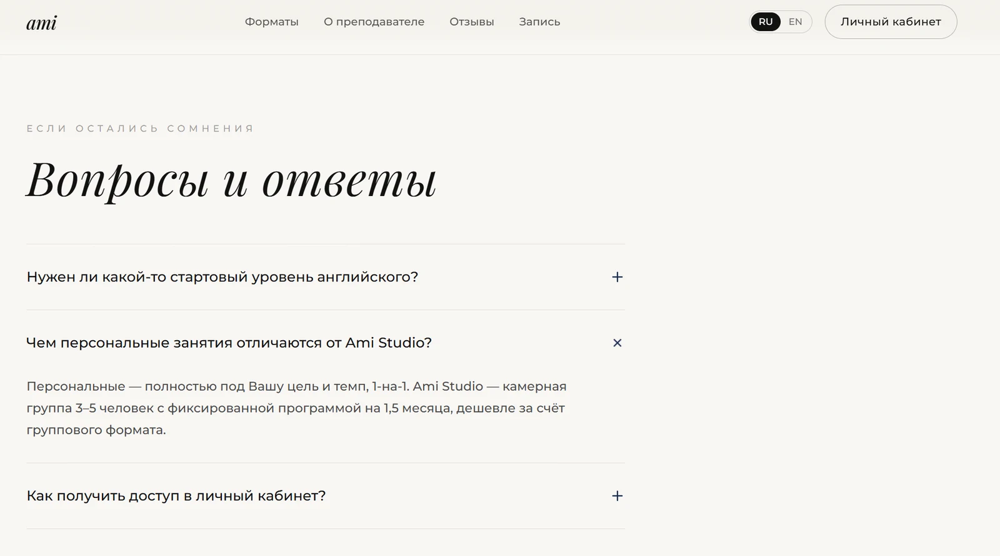
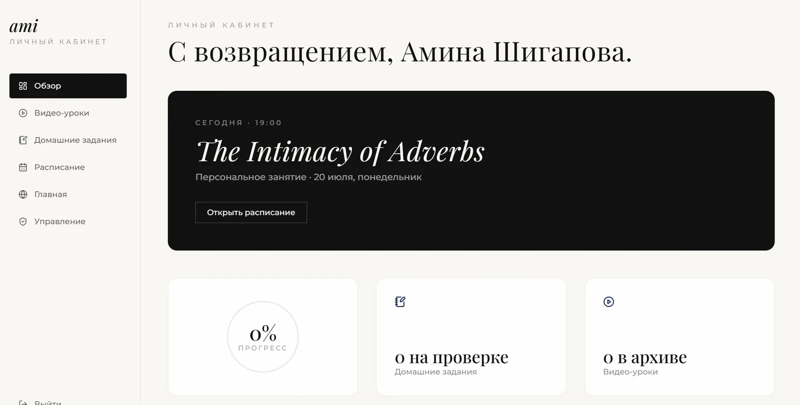
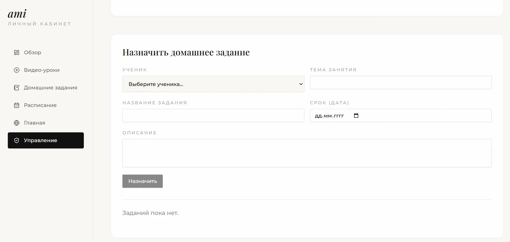
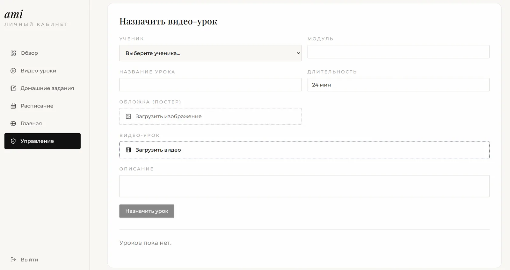

# [Lingual Étude - Ami Studio](https://amistudios.ru)

Full-stack web site for English teacher. It consists of **Landing page**, which has info on teacher, methods of educating, pricing, reviews and **Dashboard**, which provides an opportunity to load tasks, add lessons to Google calendar and read articles. 

Site does not have any registration forms, users text directly to the teacher. If they are fine with the conditions, user can register in dashboard using email (with verification) or Google Account.

Website: [amistudios.ru](https://amistudios.ru)

## About the Studio

Ami Studio is based on learning English and diving onto the depth of your inner world. I noticed by myself that it's far easier to handle some emotional talks in English rather than in a mother tongue as if you may be truly yourself without feeling 'extra' of your own feelings.

So, learn English, develop Grammar & Vocabulary and find peace with yourself in Ami Studios.

## How it was done by myself

1. Market research analysis on English tutors to outline best practices in value propostion;
2. UX/UI brainstorm to create an atmosphere of welcoming and safe space of a studio;
3. Research on RU Law Systems to check what kind of documentation is required for websites this kind (terms of use, privacy policy, cookie policy, etc)
4. Code core on Visual Studio (JS) with further bug review and design deploy from Claude;
5. Registration via email authentication was set up in Supabase -> Authentication section;
6. Google account authentication was set up via Google Cloud Console;
7. Set up Supabasse Database and Storage sections;
8. Created sample lessons and hometasks to practice students managemnts;
9. Set the 'user' and 'admin' roles;
10. Created a Cloud Storage for files, photos, videos upload;
11. Deployed to .ru domain via Cloudflare (failed), now successfully running thanks to TurboFlare.
    
## Technical tasks

| What | How? |
| --- | --- |
| User interface | React, component approach and router via React Router |
| User experience | adaptive design, Framer Motion animation и ru/en interface |
| Design | Figma, Claude, Tailwind CSS, Radix UI |
| Database and cashing | Supabase |
| Authorization | Email/password & Google OAuth via Supabase Authentication |
| Role and access  | `user` и `admin`, secured routes, Row Level Security |
| File management | Uploading videos and its covers to Supabase Storage |
| Code deploy | GitHub Actions, GitHub Pages, Turboflare and .ru domain |

## Interface

### Manifest

### About the teacher

### Pricing

### Reviews

### FAQ

### Teacher's contact

## Admin side

Admin is being authorized via email and credentials. Email address was specifially created separately for the project.

Admin has access to the 'Management' page in Dashboard and can set lessons for particular students, create hometasks for them, upload articles, additional materials, photos, videos and other **educational content which is personalized for each student.**

Admin access is **not linked** to the developer account, as teacher starts using LMS system fully, developer remains as a technical consultant on hosting and debug proccesses.
Product management and ownership could be transferred to thirtd party with changing credentials and signing 2-sided agreement.

## Stack

- React 18, React Router;
- JavaScript;
- Vite 6;
- Tailwind CSS, Radix UI;
- Supabase Authentication, Database, Storage;
- TanStack Query;
- Framer Motion;
- GitHub Actions и GitHub Pages.
